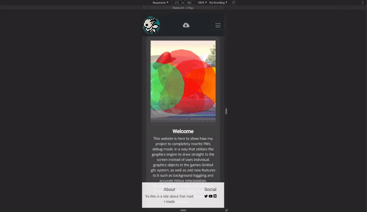

# Purpose of the Project :

Create a website to show off game modifications I've written in the past.
Based loosely on the readme i wrote for the debug mode code found [here](https://github.com/EonTAS/DebugMode).

# User Stories :

1) As a visitor I want to know about what projects have been done and how to download them.

2) As a visitor, I want to be able to know what feature are provided and what makes them cool.

3) As a visitor I want to know how completed any given feature.

4) As a user, I want to be able to suggest new ideas for the project or get in contact with the owner of the site. 

5) As a user, I want to be able to tell the creator about any bugs i experience and how to reproduce them.

6) As a potential user I want to have an easily accessible download link at all times.

7) As a user i want to be able to navigate through the page easily on both mobile and desktop.

8) As a site user i want to have easy access to the site owners other social medias etc on any page.

# Features :

1) Navbar :

    Sits at the top of the page at all times. At small screen sizes it will provide a dropdown menu to access all pages of the site, when above a medium size it rescales to fit a link to each page as individual buttons. 

2) Footer links : 

    At the bottom of the screen at all times will be a locked footer bar that contains a description of the site and links to social medias.

3) Home Page - Video : 

    A youtube video embed that correctly has 16:9 aspect ratio at all times 

3) Features Page - Image Carousel :

    On the features page, the central image will rotate between different things, with a description at the bottom of the image and a "completion" bar. At smaller sizes the description will be hidden to just show the image.

4) Report Page - Report form : 

    A form will exist to send a bug report/feature suggestion, you must fill every field to be able to submit it.

# Future Features: 

1) Form Upgrade :
    
    The report form would just perform a popup confirmation you have submitted and would actually save the data somewhere.

2) Features menu :

    shown in a menu where you hover over one box and it does a popup window detailing it more, and then clicking that opens a specific page detailing even more and describing technical parts.

# Typography and Color Scheme :

Background will be a carbon colour, relatively dark.
Text will be an off-white colour using the Exo and Roboto fonts.

# Wireframes :

## Home Page:

## Features Page

Original plan of a features page has been reworked to make use of an image carousel as seen below

Has layout for 3 sizes, where largest places images inbetween textboxes instead of below them.
Has a progress bar at the bottom of the image showing how far along the given feature is in development.

## Suggestions/Bug Reports Page 

# Testing

- W3C CSS Validation

- W3C Markup Validation

# Client Story Testing

- As a visitor I want to know about what projects have been done and how to download them.
    - A download link is provided at the top of all pages and the welcome page describes the project being worked on. 
- As a visitor, I want to be able to know what feature are provided and what makes them cool.
    - The features page is available and describes specific features for the user to read about.
- As a visitor I want to know how completed any given feature.
    - At the bottom of the image carousel in the features page there is a progress bar showing the completion level of any given feature.
- As a user, I want to be able to suggest new ideas for the project or get in contact with the owner of the site. 
    - The report page allows the user to submit a suggestion to the site owner with the provided form.
- As a user, I want to be able to tell the creator about any bugs i experience and how to reproduce them.
    - The report page allows the user to submit a bug report to the site owner with the provided form.
- As a potential user I want to have an easily accessible download link at all times.
    - Download link is available on all pages.
- As a user i want to be able to navigate through the page easily on both mobile and desktop.
    - At the top of the page, there is a dropdown menu link to all 3 pages that seperates into three buttons on large screens for easy navigation.
- As a site user i want to have easy access to the site owners other social medias etc on any page.
    - The footer of the page provides links to multiple social medias.

# Lighthouse: 
Lighthouse test results for each page are as follows: 

## Home Page

## Features Page

## Report Page

# Others:

## Page Scaling:

All pages correctly change appearance according to page size. Mostly vertically aligned content in small sizes, changing to elements in the same row with different text alignment at larger scales.

### Home Page: 

### Features Page: 

### Report Page: 

## Dropdown: 

- Expected:

Dropdown menu only shows at small screen sizes, replacing the 3 buttons

- Testing

Tested at different sizes

- Result

Works as expected.

## Navbar: 

- Expected: 

Logo resizes at same time dropdown dissapears to be make large screen sizes look better

- Testing:

Opened page at different scales.

- Result: 

Works as expected, at small screen size, top bar fills entire screen and image is contained within, at large scales it escapes those bounds.

# Deployment

I developed this project using [Gitpod IDE](https://gitpod.io/) and a git-repo hosted on GitHub. 

The page is hosted using GitHub Pages by doing the following:

1) Log in
2) Open Repo
3) Select Settings
4) Find the GitHub Pages Section
5) select the master branch as the source
6) get link from the page again.

This page can be found [here](https://EonTas.github.io/Mods-Site/.) for the forseeable future.

## How to run locally

To clone you will need a github account or other git client.
1) Open this link to the [project](https://github.com/EonTAS/Mods-Site/)
2) Under the repo name, click "clone or download" button.
3) copy the clone url for the repository.
4) In your IDE of choice, open the terminal 
5) set working directory to where you want to clone the repo.
6) type `git clone` and paste the url from step 3 and press enter.

# Credits: 

To make the youtube video correctly use a 16:9 aspect ratio, I used the css found here: https://css-tricks.com/fluid-width-video/ 

To make the carousel of images work appropriately, the example code found [here](https://getbootstrap.com/docs/4.0/components/carousel/) in the documentation was used extensively.

The video featured on the home page is not mine, it is just relevant to the topic of the site since i don't have an actual vidoe to place there. The video belongs to the SmashAcademy youtube channel.